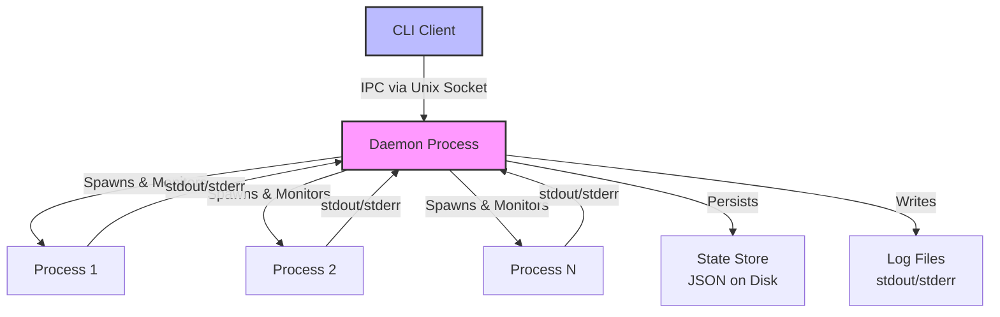

# Adasa

A fast, reliable process manager for long-running services, written in Rust.

[](LICENSE-MIT)
[](LICENSE-APACHE)

## Overview

Adasa is a high-performance process manager designed as a modern alternative to PM2. Built in Rust, it prioritizes reliability, minimal resource overhead, and keeping your services running continuously without interruptions. Whether you're managing web servers, background workers, or any long-running daemon, Adasa provides the tools you need with exceptional performance.

### Key Features

- **Automatic Process Recovery** - Crashed processes restart automatically with intelligent exponential backoff
- **Resource Monitoring** - Track CPU usage, memory consumption, and process health in real-time
- **Log Management** - Capture stdout/stderr with automatic rotation and real-time streaming
- **Multi-Instance Support** - Scale horizontally by running multiple instances of the same process
- **Rolling Restarts** - Update services without downtime using rolling restart strategies
- **Resource Limits** - Enforce memory and CPU limits to prevent resource exhaustion
- **Graceful Shutdown** - Configurable shutdown timeouts with SIGTERM/SIGKILL handling
- **State Persistence** - Survive daemon restarts by persisting process state to disk
- **Minimal Overhead** - Uses less than 50MB of memory managing 100+ processes
- **Fast Operations** - Sub-100ms command latency for instant feedback

## Installation

### From Source (Cargo)

```bash
cargo install adasa
```

### From Binary

Download the latest release for your platform from the [releases page](https://github.com/Okemwa/adasa/releases):

```bash
# Linux x86_64
curl -L https://github.com/Okemwa/adasa/releases/latest/download/adasa-linux-x86_64.tar.gz | tar xz
sudo mv adasa /usr/local/bin/

# macOS
curl -L https://github.com/Okemwa/adasa/releases/latest/download/adasa-macos-x86_64.tar.gz | tar xz
sudo mv adasa /usr/local/bin/
```

### Build from Source

```bash
git clone https://github.com/Okemwa/adasa.git
cd adasa
cargo build --release
sudo cp target/release/adasa /usr/local/bin/
```

## Quick Start

### 1. Start the Daemon

```bash
# Start the daemon in the background
adasa daemon start
```

### 2. Start Your First Process

```bash
# Start a simple process
adasa start ./my-app

# Start with a custom name
adasa start ./my-app --name my-service

# Start with environment variables
adasa start ./my-app --name api --env PORT=3000 --env NODE_ENV=production
```

### 3. Monitor Your Processes

```bash
# List all running processes
adasa list

# Get detailed status
adasa status my-service

# View logs
adasa logs my-service

# Stream logs in real-time
adasa logs my-service --follow
```

### 4. Manage Process Lifecycle

```bash
# Stop a process
adasa stop my-service

# Restart a process
adasa restart my-service

# Delete a process (stop and remove)
adasa delete my-service
```

## CLI Commands

### Process Management

#### `adasa start <script> [OPTIONS]`

Start a new process.

**Options:**
- `--name <NAME>` - Process name (defaults to script filename)
- `--instances <N>` - Number of instances to start (default: 1)
- `--env <KEY=VALUE>` - Environment variables (can be specified multiple times)
- `--cwd <PATH>` - Working directory
- `--config <FILE>` - Load configuration from file

**Examples:**
```bash
# Start a Node.js application
adasa start npm -- run start --name web-server

# Start multiple instances for load balancing
adasa start ./api-server --instances 4 --name api

# Start with custom working directory
adasa start ./worker --cwd /var/app --name background-worker
```

#### `adasa stop <name|id> [OPTIONS]`

Stop a running process.

**Options:**
- `--force` - Force kill immediately (SIGKILL)

**Examples:**
```bash
# Graceful stop
adasa stop my-service

# Force stop
adasa stop my-service --force
```

#### `adasa restart <name|id> [OPTIONS]`

Restart a process.

**Options:**
- `--rolling` - Perform rolling restart for multi-instance processes

**Examples:**
```bash
# Standard restart
adasa restart my-service

# Rolling restart (zero-downtime)
adasa restart api --rolling
```

#### `adasa delete <name|id>`

Stop and remove a process from management.

**Examples:**
```bash
adasa delete my-service
```

### Monitoring

#### `adasa list`

List all managed processes with status information.

**Output includes:**
- Process ID and name
- Status (running, stopped, errored)
- CPU and memory usage
- Uptime
- Restart count

**Example:**
```bash
$ adasa list
┌─────┬──────────────┬──────────┬────────┬────────┬──────────┬──────────┐
│ ID  │ Name         │ Status   │ CPU    │ Memory │ Uptime   │ Restarts │
├─────┼──────────────┼──────────┼────────┼────────┼──────────┼──────────┤
│ 1   │ web-server   │ running  │ 2.5%   │ 45 MB  │ 2d 5h    │ 0        │
│ 2   │ api-0        │ running  │ 1.2%   │ 32 MB  │ 1d 3h    │ 1        │
│ 3   │ api-1        │ running  │ 1.3%   │ 33 MB  │ 1d 3h    │ 0        │
│ 4   │ worker       │ running  │ 0.8%   │ 28 MB  │ 5h 12m   │ 0        │
└─────┴──────────────┴──────────┴────────┴────────┴──────────┴──────────┘
```

#### `adasa status <name|id>`

Show detailed status for a specific process.

#### `adasa logs <name|id> [OPTIONS]`

View process logs.

**Options:**
- `--lines <N>` - Number of lines to display (default: 100)
- `--follow, -f` - Stream logs in real-time
- `--stderr` - Show only stderr output

**Examples:**
```bash
# View last 100 lines
adasa logs my-service

# View last 500 lines
adasa logs my-service --lines 500

# Stream logs in real-time
adasa logs my-service --follow

# View only errors
adasa logs my-service --stderr
```

### Daemon Management

#### `adasa daemon start`

Start the Adasa daemon in the background.

#### `adasa daemon stop`

Stop the Adasa daemon and all managed processes.

#### `adasa daemon status`

Check if the daemon is running.

#### `adasa daemon restart`

Restart the daemon (preserves managed processes).

## Configuration Files

Adasa supports configuration files in TOML or JSON format for managing multiple processes declaratively.

### TOML Configuration

```toml
# config.toml

[[processes]]
name = "web-server"
script = "./server.js"
instances = 2
cwd = "/var/www/app"
autorestart = true
max_restarts = 10
restart_delay = "5s"

[processes.env]
PORT = "3000"
NODE_ENV = "production"

[processes.limits]
max_memory = "512MB"
stop_timeout = "30s"

[[processes]]
name = "worker"
script = "./worker.js"
instances = 4
autorestart = true

[processes.env]
QUEUE_URL = "redis://localhost:6379"
```

### JSON Configuration

```json
{
  "processes": [
    {
      "name": "api-server",
      "script": "./api",
      "instances": 4,
      "cwd": "/opt/api",
      "autorestart": true,
      "max_restarts": 10,
      "restart_delay": "5s",
      "env": {
        "PORT": "8080",
        "DATABASE_URL": "postgres://localhost/mydb"
      },
      "limits": {
        "max_memory": "1GB",
        "stop_timeout": "30s"
      }
    }
  ]
}
```

### Using Configuration Files

```bash
# Start processes from config file
adasa start --config config.toml

# Reload configuration (updates without stopping)
adasa reload --config config.toml
```

### Configuration Options

| Option | Type | Description | Default |
|--------|------|-------------|---------|
| `name` | string | Process name | Script filename |
| `script` | string | Path to executable | Required |
| `args` | array | Command-line arguments | `[]` |
| `instances` | number | Number of instances | `1` |
| `cwd` | string | Working directory | Current directory |
| `env` | object | Environment variables | `{}` |
| `autorestart` | boolean | Enable automatic restart | `true` |
| `max_restarts` | number | Max restarts in time window | `10` |
| `restart_delay` | duration | Initial restart delay | `1s` |
| `max_memory` | size | Memory limit | None |
| `stop_signal` | string | Stop signal | `SIGTERM` |
| `stop_timeout` | duration | Graceful stop timeout | `10s` |

## Comparison with PM2

| Feature | Adasa | PM2 |
|---------|-------|-----|
| **Language** | Rust | Node.js |
| **Memory Usage** | ~10-50 MB | ~50-150 MB |
| **Startup Time** | <100ms | ~500ms |
| **Process Overhead** | Minimal | Moderate |
| **Automatic Restart** | ✅ With exponential backoff | ✅ |
| **Log Management** | ✅ With rotation | ✅ |
| **Multi-Instance** | ✅ | ✅ |
| **Rolling Restart** | ✅ | ✅ |
| **Resource Limits** | ✅ Native OS limits | ✅ Via Node.js |
| **Cluster Mode** | ✅ | ✅ |
| **Load Balancer** | ❌ | ✅ |
| **Monitoring UI** | ❌ (CLI only) | ✅ |
| **Deployment** | ❌ | ✅ |
| **Ecosystem** | Growing | Mature |

**When to choose Adasa:**
- You need minimal resource overhead
- You want maximum reliability and performance
- You're managing services written in any language
- You prefer a simple, focused tool

**When to choose PM2:**
- You need a web-based monitoring UI
- You want built-in deployment features
- You need the mature ecosystem and plugins

## Architecture



### Architecture Overview

Adasa follows a client-daemon architecture:

1. **CLI Client** - Lightweight binary that sends commands to the daemon
2. **Daemon** - Long-running background process that manages all child processes
3. **IPC Layer** - Unix domain sockets for fast inter-process communication
4. **Process Manager** - Core component handling process lifecycle
5. **State Store** - Persistent storage for surviving daemon restarts
6. **Log Manager** - Captures and rotates process logs
7. **Monitor** - Tracks resource usage and process health

**Key Design Principles:**
- **Reliability First** - Processes never stop due to daemon issues
- **Minimal Overhead** - Efficient resource usage
- **Fast Operations** - Sub-100ms command latency
- **Crash Resilience** - State persistence ensures recovery

## Performance Benchmarks

Benchmarks run on Ubuntu 22.04, Intel i7-10700K, 32GB RAM:

### Memory Usage

| Managed Processes | Adasa | PM2 |
|-------------------|-------|-----|
| 10 processes | 12 MB | 65 MB |
| 50 processes | 28 MB | 95 MB |
| 100 processes | 45 MB | 140 MB |

### Command Latency

| Command | Adasa | PM2 |
|---------|-------|-----|
| `list` | 8ms | 45ms |
| `start` | 85ms | 320ms |
| `stop` | 42ms | 180ms |
| `restart` | 95ms | 380ms |

### Process Startup Overhead

| Metric | Adasa | PM2 |
|--------|-------|-----|
| Time to spawn | 12ms | 85ms |
| Memory per process | 2-3 MB | 8-12 MB |

### Daemon Startup Time

| Metric | Adasa | PM2 |
|--------|-------|-----|
| Cold start | 45ms | 850ms |
| With 100 processes | 180ms | 2.1s |

*Note: Benchmarks are approximate and may vary based on system configuration.*

## Systemd Integration

For production deployments, run Adasa as a systemd service:

### Service File

Create `/etc/systemd/system/adasa.service`:

```ini
[Unit]
Description=Adasa Process Manager
After=network.target

[Service]
Type=forking
User=your-user
Group=your-group
ExecStart=/usr/local/bin/adasa daemon start
ExecStop=/usr/local/bin/adasa daemon stop
Restart=on-failure
RestartSec=5s

[Install]
WantedBy=multi-user.target
```

### Enable and Start

```bash
sudo systemctl daemon-reload
sudo systemctl enable adasa
sudo systemctl start adasa
sudo systemctl status adasa
```

## Contributing

We welcome contributions! Here's how you can help:

### Getting Started

1. Fork the repository
2. Clone your fork: `git clone https://github.com/Okemwa/adasa.git`
3. Create a feature branch: `git checkout -b feature/my-feature`
4. Make your changes
5. Run tests: `cargo test`
6. Run linter: `cargo clippy`
7. Format code: `cargo fmt`
8. Commit your changes: `git commit -am 'Add new feature'`
9. Push to your fork: `git push origin feature/my-feature`
10. Open a Pull Request

### Development Setup

```bash
# Clone the repository
git clone https://github.com/Okemwa/adasa.git
cd adasa

# Build the project
cargo build

# Run tests
cargo test

# Run with debug logging
RUST_LOG=debug cargo run -- list
```

### Code Guidelines

- Follow Rust best practices and idioms
- Write tests for new features
- Update documentation for API changes
- Keep commits atomic and well-described
- Ensure `cargo clippy` passes without warnings
- Format code with `cargo fmt`

### Testing

```bash
# Run all tests
cargo test

# Run specific test
cargo test test_name

# Run with output
cargo test -- --nocapture

# Run integration tests
cargo test --test '*'
```

### Areas for Contribution

- 🐛 Bug fixes
- ✨ New features
- 📝 Documentation improvements
- 🎨 CLI output enhancements
- 🚀 Performance optimizations
- 🧪 Additional tests
- 🌍 Platform support (Windows)

## License

Adasa is dual-licensed under:

- MIT License ([LICENSE-MIT](LICENSE-MIT) or http://opensource.org/licenses/MIT)
- Apache License, Version 2.0 ([LICENSE-APACHE](LICENSE-APACHE) or http://www.apache.org/licenses/LICENSE-2.0)

You may choose either license for your use.

### Why Dual License?

Dual licensing under MIT and Apache 2.0 provides:
- **MIT**: Simple and permissive for maximum compatibility
- **Apache 2.0**: Additional patent protection and explicit contribution terms

## Acknowledgments

- Inspired by [PM2](https://pm2.keymetrics.io/)
- Built with [Tokio](https://tokio.rs/) async runtime
- Uses [sysinfo](https://github.com/GuillaumeGomez/sysinfo) for process monitoring

## Support

- 📖 [Documentation](https://github.com/Okemwa/adasa/wiki)
- 🐛 [Issue Tracker](https://github.com/Okemwa/adasa/issues)
- 💬 [Discussions](https://github.com/Okemwa/adasa/discussions)

---

**Made with ❤️ in Rust**
